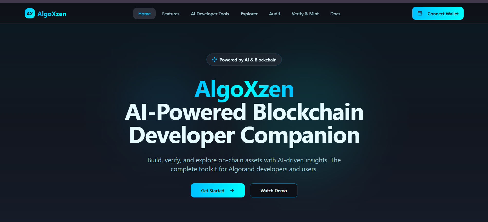

# 🚀 AlgoXzen – AI-Powered Blockchain & Developer Companion

AlgoXzen is a next-generation AI assistant built on the Algorand blockchain that combines *multimodal document/media verification*, **smart contract development**, **blockchain exploration**, and **auditing** into a unified ecosystem.  
It enables users to *upload, tokenize, and verify* documents, images, audio, and videos as NFTs/ASAs, while offering powerful *AI tools for developers* to create, debug, and deploy smart contracts using **AlgoKit** and **Algopy/PyTeal**.

Accessible across **Web, VS Code, Telegram, and CLI**, AlgoXzen provides **on-chain trust**, **AI-powered insights**, and **intelligent developer assistance** for the entire Algorand ecosystem.


---

## 🧠 Problem Statement

Developers and creators on blockchain platforms often face challenges such as:
- Lack of *AI-integrated tools* for smart contract creation and debugging.
- Absence of *trusted verification systems* for digital content and media.
- Fragmented ecosystems requiring multiple platforms for development, auditing, and verification.

*AlgoXzen* addresses these gaps by offering an *AI-driven, all-in-one platform* that merges blockchain trust with intelligent automation.

---

## 🎯 Objectives

- ✅ Enable *AI-assisted smart contract generation* using Algopy/PyTeal.
- ✅ Provide *document, audio, and video verification* via tokenization (NFT/ASA).
- ✅ Allow *on-chain audits* and vulnerability detection for Algorand contracts.
- ✅ Offer *natural language blockchain exploration* with real-time insights.
- ✅ Ensure *secure ownership and access control* using smart contracts.

---

## 🌐 Deployed Frontend

**Production URL:**  
https://algoxzen.netlify.app/

---

## 🔗 Deployed Contracts & Assets (TestNet)

Use this tool to verify your contracts/assets:  
👉 https://lora.algokit.io/testnet

Replace the placeholder values below after deployment:

- **Smart Contract Application ID:** `749707480`

**Explorer Links:**

- AlgoExplorer (app):  
   https://lora.algokit.io/testnet/application/749707480

- AlgoExplorer (Testnet Activity/Transactions):  
  https://lora.algokit.io/testnet/account/DDYREIIAMRSXHL7LXNDNAI7ULUPPC2NY4TNPYVDEEHCH5WXAM76ABQQ5LE
- ABI Method Verification:  
  https://lora.algokit.io/testnet/transaction/7NK2KM4D7BDNJXFNPCKNEPDT44J3PSVM5G2J3TLFGHGZCVW6WG6Q

## 📸 Screenshots

Here’s a preview of the *AlgoXzen Dashboard* in action:

<p align="center">
  
</p>

## 🌟 Key Features

### 📄 1. Document & Media Verification
- Upload PDFs, Word files, images, audio, or video.
- Tokenize and store unique file hashes as NFTs/ASAs on Algorand.
- Verify authenticity, timestamp, and ownership on-chain.
- Generate *QR codes* for certificate or contract validation.
- AI-powered summarization, keyword extraction, and metadata analysis.

---

### 🤖 2. Smart Contract Developer Assistant
- Generate templates for *ARC4, ASA, DAO, and Escrow* contracts.
- AI-assisted debugging and optimization for PyTeal/Algopy code.
- Convert Python/JS snippets into deployable smart contracts.
- Explains *Algorand SDK usage* and ARC standards in plain language.
- Integrates with *VS Code, Telegram, and CLI* for seamless support.

---

### 🔍 3. Blockchain Explorer & Query Bot
- Use *natural language queries* such as:
  - “Show last 5 transactions of wallet X.”
  - “Which smart contracts interacted with ASA 123?”
- Filter and search by wallet, NFTs, dApps, or DAOs.
- Receive alerts for *suspicious or high-value movements*.
- Export blockchain insights as *CSV/JSON* for analytics.

---

### 🧾 4. Smart Contract Auditor
- Automated *security scanning* for PyTeal/Algopy contracts.
- Detects *vulnerabilities, logic flaws, and fee inefficiencies*.
- Generates *comprehensive audit reports*.
- Integrates with *CI/CD pipelines* for continuous security validation.

---

### 🔑 5. Ownership, Access Control & Monetization
- Issue *verified certificates, contracts, or digital assets* as NFTs.
- Manage *access rights* and revocations via smart contracts.
- Enable *collaborative sharing* with role-based permissions.
- Support for *licensing and monetization* of verified content.

---

## 📸 Algokit Explore Screenshots

Here’s a preview of the *AlgoXzen Transactions* in action:

<p align="center">
  
</p>

## ⚙️ Tech Stack

### 🌐 Frontend
- *React JS* for web interface  
- *Tailwind CSS* for responsive design  
- *Pera Wallet SDK* for wallet integration  
- *IPFS* for decentralized storage  
- *Telegram Bot API* for chat-based access  

### 🧠 Backend & AI Layer
- *Python (FastAPI)* for server logic  
- *OpenAI / Vertex AI APIs* for LLM-powered responses  
- *LangChain* for AI workflow orchestration  
- *Pinecone / Chroma* for vector search and embeddings  

### 🔗 Blockchain Layer
- *Algorand Smart Contracts (ASC1)* using *Algopy/PyTeal*  
- *AlgoKit* for project scaffolding, deployment, and testing  
- *Algorand SDK* for wallet and contract interactions  

---

## 🧪 Functional Modules

| *Module*          | *Functionality*                                        |
| -------------------- | -------------------------------------------------------- |
| File Upload          | Upload & tokenize document/media as NFT/ASA             |
| Verification Engine  | Verify authenticity, timestamp, and ownership on-chain  |
| AI Assistant         | Generate & explain smart contract code                  |
| Blockchain Explorer  | Natural language blockchain data querying               |
| Auditor              | Detect vulnerabilities & generate audit reports         |
| Access Control       | Role-based sharing and permission management            |
| Monetization         | Enable content licensing & revenue generation           |

---

## 🧾 Prerequisites

Before running the project locally, ensure you have:

- [Node.js](https://nodejs.org/) ≥ v16  
- [Python](https://www.python.org/) ≥ v3.10  
- [AlgoKit](https://github.com/algorandfoundation/algokit-cli)  
- [Pera Wallet](https://perawallet.app/) (Mobile/Extension)  
- Git installed  

---

## ⚡ Installation Steps


### Clone & Install

```bash
# Clone repository
git clone https://github.com/<your-username>/AlgoXzen.git
cd AlgoXzen

# Frontend setup
cd frontend
npm install
npm run dev

# Smart contract setup
cd ../contracts
poetry install
poetry run python -m smart_contracts build

# Deploy contracts using AlgoKit
algokit project run deploy
